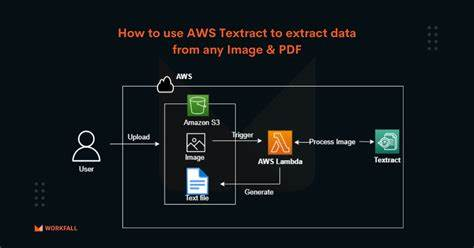

# MiniProjects-Using-AWSServices

## 1.Talkify- A Text to Speech Converter using Amazon Polly Service

Amazon Polly uses deep learning technologies to synthesize natural-sounding human speech, so you can convert articles to speech. With dozens of lifelike voices across a broad set of languages, use Amazon Polly to build speech-activated applications.


### Python Code
```python

import tkinter as tk #module in python to prepare the GUI
import boto3
import os
import sys
from tempfile import gettempdir
from contextlib import closing


root=tk.Tk()
root.geometry("400x240")
root.title("T2S-Converter Amazon Polly")

textExample=tk.Text(root,height=10)
textExample.pack()

def getText():
    aws_mag_con=boto3.session.Session(profile_name='text-to-speech')
    client=aws_mag_con.client(service_name='polly',region_name='us-east-1')

    result=textExample.get("1.0","end")
    print(result)

    response=client.synthesize_speech(VoiceId='Joanna',OutputFormat='mp3',Text=result,Engine='neural')
    print(response)

    if "AudioStream" in response:
        with closing(response['AudioStream']) as stream:
            output=os.path.join(gettempdir(),"speech.mp3")
            try:
                with open(output,"wb") as file:
                    file.write(stream.read())
                print("Text converted to speech successfully!")

            except IOError as error:
                print(error)
                sys.exit(-1)

    else:
        print("Could not find the stream!!")   
        sys.exit(-1)

    if sys.platform=='win32':
        os.startfile(output)
                     
btnRead=tk.Button(root,height=1,width=10,text="Convert",command=getText)
btnRead.pack()

root.mainloop()   

```
### Description

This Python code creates a graphical user interface (GUI) using the tkinter library for a Text-to-Speech (T2S) converter that utilizes Amazon Polly's TTS (Text-to-Speech) service. Here's a brief description of what the code does:

1. It imports the necessary libraries, including tkinter for GUI creation, boto3 for AWS interaction, and other standard modules.

2. The GUI window is created with dimensions 400x240 pixels and is titled "T2S-Converter Amazon Polly."

3. Inside the GUI, there's a text input field (Text widget) where users can input the text they want to convert to speech.

4. There's a "Convert" button that, when clicked, triggers the getText function.

5. In the getText function:

  * It sets up an AWS session using the 'text-to-speech' profile and creates a Polly client.
  * Retrieves the text entered by the user from the Text widget.
  * Uses Amazon Polly to synthesize speech from the entered text with a specified voice (Joanna), output format (mp3), and speech engine (neural).
  * If successful, it saves the synthesized speech as an MP3 file in the system's temporary directory.
  * If running on Windows, it opens the generated MP3 file using the default system application.

6. The code handles various error scenarios, such as the absence of an "AudioStream" in the Polly response and I/O errors during file writing.

7. Finally, it starts the GUI main loop using root.mainloop(), which keeps the application running and responsive to user interactions.

### On Running the Solution


## 2.ScanVault-A Text Extractor Using Amazon Textract Service

Amazon Textract is an advanced machine learning service that automates the extraction of text, handwriting, and data from scanned documents, including tables and forms, eliminating the need for manual data entry or OCR configuration. It revolutionizes document processing by significantly reducing time and effort while maintaining accuracy, with the option to enhance data validation through Amazon Augmented AI.


