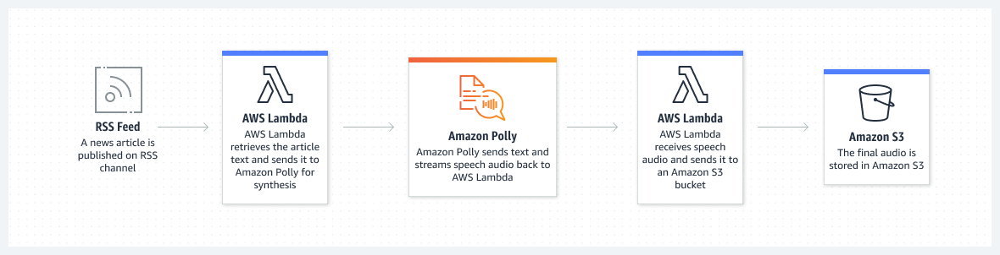
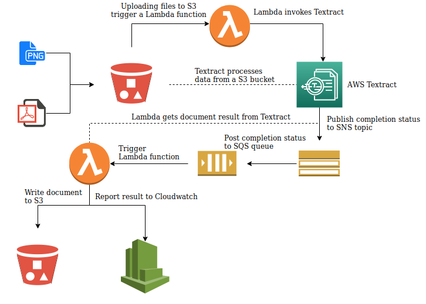

# MiniProjects-Using-AWSServices

## 1. Talkify- A Text to Speech Converter using Amazon Polly Service

Amazon Polly uses deep learning technologies to synthesize natural-sounding human speech, so you can convert articles to speech. With dozens of lifelike voices across a broad set of languages, use Amazon Polly to build speech-activated applications.



### Python Code
```python

import tkinter as tk #module in python to prepare the GUI
import boto3
import os
import sys
from tempfile import gettempdir
from contextlib import closing


root=tk.Tk()
root.geometry("400x240")
root.title("T2S-Converter Amazon Polly")

textExample=tk.Text(root,height=10)
textExample.pack()

def getText():
    aws_mag_con=boto3.session.Session(profile_name='text-to-speech')
    client=aws_mag_con.client(service_name='polly',region_name='us-east-1')

    result=textExample.get("1.0","end")
    print(result)

    response=client.synthesize_speech(VoiceId='Joanna',OutputFormat='mp3',Text=result,Engine='neural')
    print(response)

    if "AudioStream" in response:
        with closing(response['AudioStream']) as stream:
            output=os.path.join(gettempdir(),"speech.mp3")
            try:
                with open(output,"wb") as file:
                    file.write(stream.read())
                print("Text converted to speech successfully!")

            except IOError as error:
                print(error)
                sys.exit(-1)

    else:
        print("Could not find the stream!!")   
        sys.exit(-1)

    if sys.platform=='win32':
        os.startfile(output)
                     
btnRead=tk.Button(root,height=1,width=10,text="Convert",command=getText)
btnRead.pack()

root.mainloop()   

```
### Description

This Python code creates a graphical user interface (GUI) using the tkinter library for a Text-to-Speech (T2S) converter that utilizes Amazon Polly's TTS (Text-to-Speech) service. Here's a brief description of what the code does:

1. It imports the necessary libraries, including tkinter for GUI creation, boto3 for AWS interaction, and other standard modules.

2. The GUI window is created with dimensions 400x240 pixels and is titled "T2S-Converter Amazon Polly."

3. Inside the GUI, there's a text input field (Text widget) where users can input the text they want to convert to speech.

4. There's a "Convert" button that, when clicked, triggers the getText function.

5. In the getText function:

  * It sets up an AWS session using the 'text-to-speech' profile and creates a Polly client.
  * Retrieves the text entered by the user from the Text widget.
  * Uses Amazon Polly to synthesize speech from the entered text with a specified voice (Joanna), output format (mp3), and speech engine (neural).
  * If successful, it saves the synthesized speech as an MP3 file in the system's temporary directory.
  * If running on Windows, it opens the generated MP3 file using the default system application.

6. The code handles various error scenarios, such as the absence of an "AudioStream" in the Polly response and I/O errors during file writing.

7. Finally, it starts the GUI main loop using root.mainloop(), which keeps the application running and responsive to user interactions.

Overall, this code provides a simple GUI interface for users to input text and convert it to speech using Amazon Polly's TTS service, with the option to play the generated audio file on Windows systems.

### On Running the Solution


## 2. ScanVault-A Text Extractor Using Amazon Textract Service

Amazon Textract is an advanced machine learning service that automates the extraction of text, handwriting, and data from scanned documents, including tables and forms, eliminating the need for manual data entry or OCR configuration. It revolutionizes document processing by significantly reducing time and effort while maintaining accuracy, with the option to enhance data validation through Amazon Augmented AI.



### Python code
```python
import tkinter as tk
from tkinter import filedialog
from tkinter.filedialog import askopenfile
from PIL import Image, ImageTk
import boto3

my_w = tk.Tk()
my_w.geometry("450x400")
my_w.title("AWS Textract")

l1 = tk.Label(my_w, text="Upload the Image", width=30, font=('times', 18, 'bold'))
l1.pack()

def upload_file():
    aws_mag_con = boto3.session.Session(profile_name='text-to-speech')
    client = aws_mag_con.client(service_name='textract', region_name='us-east-1')

    global img
    f_types = [('Jpg Files', '*.jpg')]
    filename = filedialog.askopenfilename(filetypes=f_types)

    img = Image.open(filename)
    img_resized = img.resize((400, 200))
    img_tk = ImageTk.PhotoImage(img_resized)
    img_label = tk.Label(my_w, image=img_tk)
    img_label.image = img_tk  
    img_label.pack()

    imgbytes = get_image_byte(filename)

    response = client.detect_document_text(Document={'Bytes': imgbytes})
    for item in response['Blocks']:
        if item['BlockType'] == 'WORD': 
            print(item['Text'])

def get_image_byte(filename):
    with open(filename, 'rb') as imgfile:
        return imgfile.read()

b1 = tk.Button(my_w, text='Upload File and See What it has!!', width=30, command=upload_file)
b1.pack()

my_w.mainloop()

```

### Description 

This Python code creates a graphical user interface (GUI) using the tkinter library for interacting with Amazon Textract, a service for extracting text from images. Here's a brief description of what the code does:

1. It imports the necessary libraries, including tkinter for GUI creation, filedialog for file selection, and PIL (Pillow) for image handling, along with the boto3 library for AWS interaction.

2. The GUI window is created with dimensions 450x400 pixels and is titled "AWS Textract."

3. It provides a label ("Upload the Image") to instruct the user.

4. When the "Upload File and See What it has!!" button is clicked, it triggers the upload_file function.

5. In the upload_file function:

* It sets up an AWS session using the 'text-to-speech' profile and creates a Textract client in the 'us-east-1' region.
* Opens a file dialog to allow the user to select an image file (restricted to JPG format).
* Resizes the selected image for display in the GUI and converts it to a PhotoImage object.
* Displays the resized image in a label within the GUI.
* Reads the image file as bytes and passes it to Textract for text extraction.
* Iterates through the extracted text blocks (in this case, words) and prints them to the console.

6. The get_image_byte function reads the selected image file and returns its contents as bytes.

7. The GUI is started with my_w.mainloop(), keeping the application responsive to user interactions.

Overall, this code allows users to upload an image, displays it in the GUI, and uses Amazon Textract to extract and print the text content from the image when the "Upload File and See What it has!!" button is pressed.

### On Running the Solution


